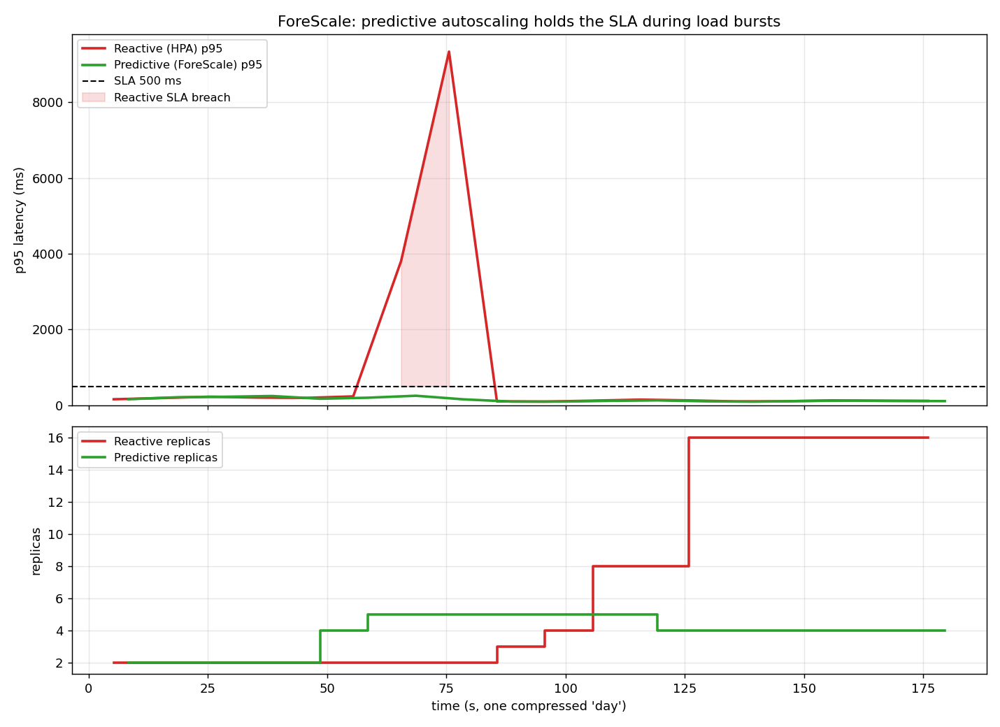
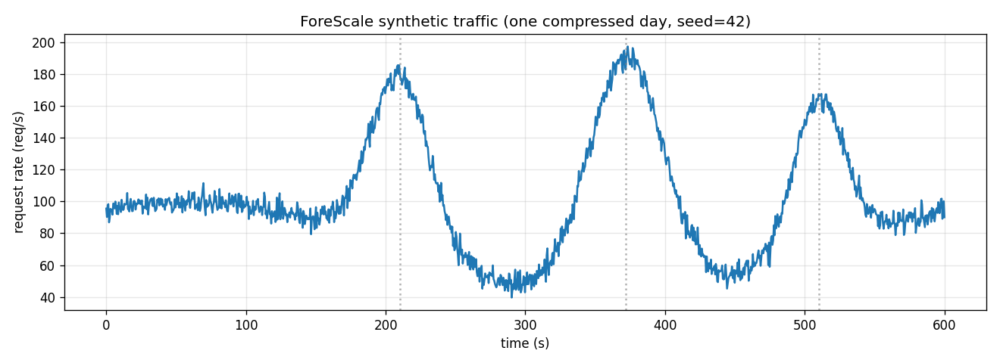

# ForeScale: predictive autoscaling for Kubernetes

> **Scale pods *before* the load arrives.** ForeScale is an ML-driven, predictive
> autoscaler that keeps tail latency under SLA during traffic bursts where the
> native, reactive HorizontalPodAutoscaler breaches it, and it does so with
> fewer pods.


---

## The problem: reactive vs. predictive

Kubernetes' built-in **HorizontalPodAutoscaler (HPA) is reactive**. It adds pods
only *after* it observes utilisation rise. But a new pod is not free: it takes
**30 s – 2 min** to pull, start, warm up and pass readiness. During that window
the *existing* pods are saturated, requests queue, and **p95 latency blows past
the SLA** (here: 500 ms).

**ForeScale is proactive.** A time-series model forecasts the request rate one
**lead time** (≈ a pod's cold-start) into the future, and the controller scales
the Deployment **ahead of time**, so the new pods are already *warm* when the
burst hits. p95 stays under the SLA.

```
                 load
                  │            ┌─ burst ─┐
        rps ──────┘            │         │
                          ┌────┘         └────┐
   ───────────────────────┘                   └───────────────►  t

   Reactive HPA:   sees burst → starts pods → pods Ready 60s LATE → SLA breach
   ForeScale:      forecasts burst 60s ahead → pods warm on arrival → SLA held
```

## Demo: reactive vs. predictive on a real Kubernetes cluster

Same seeded traffic, two strategies, run **end-to-end on a single-node `kind`
cluster** (`make demo`): real pods, real CPU work, scaled through Prometheus and
the Kubernetes API. To make fast-booting demo pods behave like a real ML
container, `inference-api` reports *not ready* for its first `STARTUP_DELAY_S`
(45 s), reproducing the cold-start penalty the whole thesis depends on.



- **Top:** p95 latency. Red (reactive HPA) spikes to **9.3 s** during the burst
  (shaded breach); green (ForeScale) stays flat under the 500 ms SLA.
- **Bottom:** replica count. ForeScale pre-scales **before** the burst (~t=48);
  the HPA only starts reacting **after** it hits (~t=85), then panic-scales to 16.

### Headline numbers (real cluster)

| Metric | Reactive (HPA) | Predictive (ForeScale) |
|---|---:|---:|
| Max p95 latency (ms) | **9342** | **249** |
| Max p99 latency (ms) | 9792 | 293 |
| **Total SLA breach time (s)** | **20** | **0** |
| Requests over SLA | 1 527 (9.5%) | 0 (0.0%) |
| Mean replicas | 7.5 | **3.9** |
| Peak replicas | 16 | **5** |

**ForeScale holds the SLA *and* runs at ~half the pod cost** (3.9 vs 7.5 mean
replicas): it provisions precisely for what's coming instead of over-reacting to
what already happened. See [`results/results.md`](results/results.md).

> The identical comparison also runs **without any cluster** via an offline
> queueing simulator (`make demo-sim`, used in CI): same story, reproducible
> anywhere in ~30 s.

### It scales on the *forecast*, not the current load

Real controller logs from the run above. At `t=5s` the live load is barely
non-zero, yet it has already provisioned 5 warm pods because it predicts ~176 rps
arriving in 60 s, so they are hot when the burst lands:

```
[forescale-controller] starting: target=forescale/inference-api lead=60s capacity=50rps margin=30%
[forescale-controller] t=5s   observed=11.7rps  predicted(+60s)=176.1rps  replicas 4 -> 5
[forescale-controller] t=55s  observed=89.5rps  predicted(+60s)=192.0rps  replicas 5 -> 5   # burst hits warm
```

The reactive HPA, by contrast, has nothing to react to at `t=5s` and is still at
its 2-pod floor when the burst arrives, then it is a full cold-start behind.

## How it works

```
                        ┌──────────────────────────────────────────────┐
                        │                  Kubernetes                   │
   ┌──────────────┐     │   ┌───────────────┐      ┌──────────────────┐ │
   │ load-        │ HTTP│   │ inference-api │      │ forescale-       │ │
   │ generator    ├─────┼──►│  (Deployment) │◄─────┤ controller       │ │
   │ (traffic     │     │   │  /predict     │ patch│  • reads rps      │ │
   │  curve)      │     │   │  /metrics     │ scale│  • forecasts +60s │ │
   └──────────────┘     │   └──────┬────────┘      │  • desired pods   │ │
                        │          │ scrape        └─────────▲────────┘ │
                        │     ┌────▼─────┐                   │          │
                        │     │Prometheus├───────────────────┘ query    │
                        │     └────┬─────┘                              │
                        │     ┌────▼─────┐                              │
                        │     │ Grafana  │  dashboards                  │
                        │     └──────────┘                              │
                        └──────────────────────────────────────────────┘
```

Every `CONTROL_PERIOD` the controller:

1. reads the recent aggregate request rate from **Prometheus**,
2. asks the **forecaster** for the rate at `now + LEAD_TIME`,
3. computes `desired = ceil(predicted_rps / CAPACITY_RPS × (1 + SAFETY_MARGIN))`,
   clamped to `[MIN_REPLICAS, MAX_REPLICAS]`, using `max(forecast, current)` plus
   a short max-hold so it never strips pre-warmed pods just before a peak,
4. **patches** the `inference-api` Deployment via the Kubernetes API.

The **forecaster** is a `HistGradientBoostingRegressor` over calendar features
(fraction-of-day + sin/cos seasonality) and autoregressive lags, behind a small
`Forecaster` interface (`fit` / `predict_one`) so Prophet or anything else can be
swapped in. On the synthetic workload it beats a naive persistence baseline by
**~86 % MAE** (`make train`).

The synthetic traffic curve (base + day/night seasonality + scheduled bursts) is
seeded and lives in one shared module, so the reactive and predictive runs replay
the **identical** workload, the only way the comparison is fair:



## Tech stack

| Layer            | Tech                                                          |
|------------------|--------------------------------------------------------------|
| App              | Python 3.11, FastAPI, Uvicorn, prometheus-client             |
| ML               | scikit-learn (HistGradientBoosting), NumPy, joblib           |
| Control          | Kubernetes Python client, custom control loop                |
| Orchestration    | kind, kubectl, Helm, metrics-server                          |
| Observability    | Prometheus, Grafana (provisioned dashboard)                  |
| Quality          | pytest, ruff, GitHub Actions CI                              |

## Quickstart

### Zero-dependency path (no cluster): generate the graph in ~30 s

```bash
make venv        # create .venv, install deps
make demo-sim    # -> results/comparison.png + results/results.md
make test        # unit tests
```

### Full Kubernetes path

**Prerequisites:** Docker, [kind](https://kind.sigs.k8s.io/), kubectl, Helm.

```bash
make up          # create kind cluster, build & load images, deploy everything
make demo        # reactive vs predictive on the real cluster -> results/
make grafana     # open http://localhost:3000 (admin/admin)
make down        # tear down the cluster
```

Single-mode runs: `make demo-reactive` / `make demo-predictive`.

### Helm

```bash
helm install forescale ./helm/forescale -n forescale --create-namespace \
  --set mode=predictive --set config.capacityRps=50 --set config.leadTime=60
# reactive baseline instead:
helm upgrade forescale ./helm/forescale -n forescale --set mode=reactive
```

## Project structure

```
forescale/
├── libs/forescale_core/      # SHARED: seeded traffic curve + replica math
├── services/
│   ├── inference-api/        # FastAPI target app (real CPU work, Prometheus)
│   ├── load-generator/       # replays the seeded curve, logs latency
│   └── forescale-controller/ # the predictive Kubernetes controller + RBAC
├── forecaster/               # Forecaster interface, HGB impl, train.py, tests
├── experiments/              # simulator + run_comparison + k8s runner + tests
├── k8s/                      # all manifests (non-root, probes, RBAC, HPA, obs)
├── helm/forescale/           # Helm chart (mode=predictive|reactive)
├── observability/            # Prometheus config + Grafana dashboard JSON
└── results/                  # comparison.png + results.md (generated)
```

## Engineering notes & pitfalls handled

- **Real CPU work**, not `sleep`, in `/predict`, otherwise the CPU-based HPA
  would never react (verified accurate to ~0.01 ms).
- **One seeded traffic curve**, replayed identically (same `START_EPOCH`) for
  both modes and for the controller's forecast clock, so the comparison is fair
  *and* the predictive pre-warming is correctly timed.
- **Simulated cold-start** (`STARTUP_DELAY_S`) makes a tiny demo pod behave like a
  real ML container, which is what the whole argument hinges on.
- **HPA and controller are mutually exclusive**: predictive mode deletes the HPA
  so two controllers never fight over the replica count.
- **Non-root, gid 0, capability-dropped, read-only-rootfs** containers on a high
  port (OpenShift-compatible).

## Limitations (honest)

- **Unpredictable spikes can't be anticipated.** ForeScale wins on *recurring* /
  *learnable* demand. For genuine surprises, keep it as the proactive layer **on
  top of an HPA safety net**, exactly the `max(forecast, current)` + max-hold
  pattern used here.
- **Forecast quality is everything.** A bad model over- or under-provisions; the
  project ships an MAE check and a test asserting the model beats a naive baseline.
- **Cost vs. SLA is a knob.** `SAFETY_MARGIN` trades head-room for spend; the
  right value depends on your SLA and cold-start time.
- **The synthetic workload is a model.** A documented extension point in
  `forescale_core.traffic` lets you swap in real HTTP logs (e.g. NASA-HTTP).
- **The offline simulator approximates** the real queueing/cold-start dynamics so
  the headline result is reproducible without a cluster; `make demo` runs the
  same controller against real pods.

## License

MIT. See [LICENSE](LICENSE).
